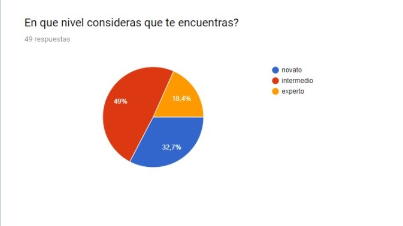
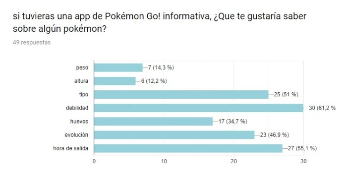
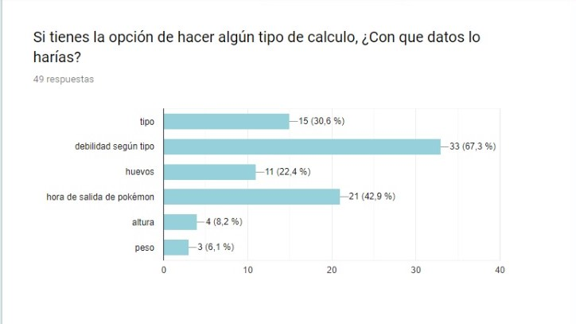
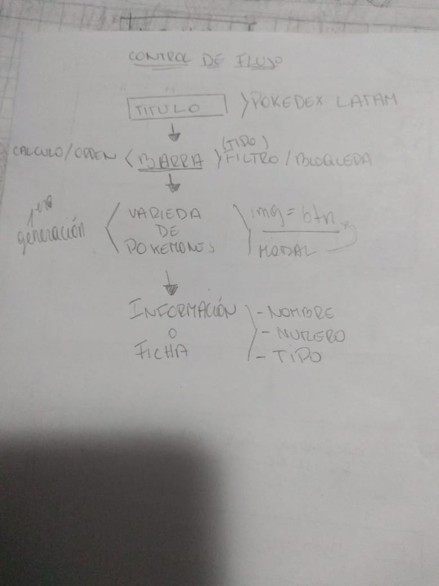
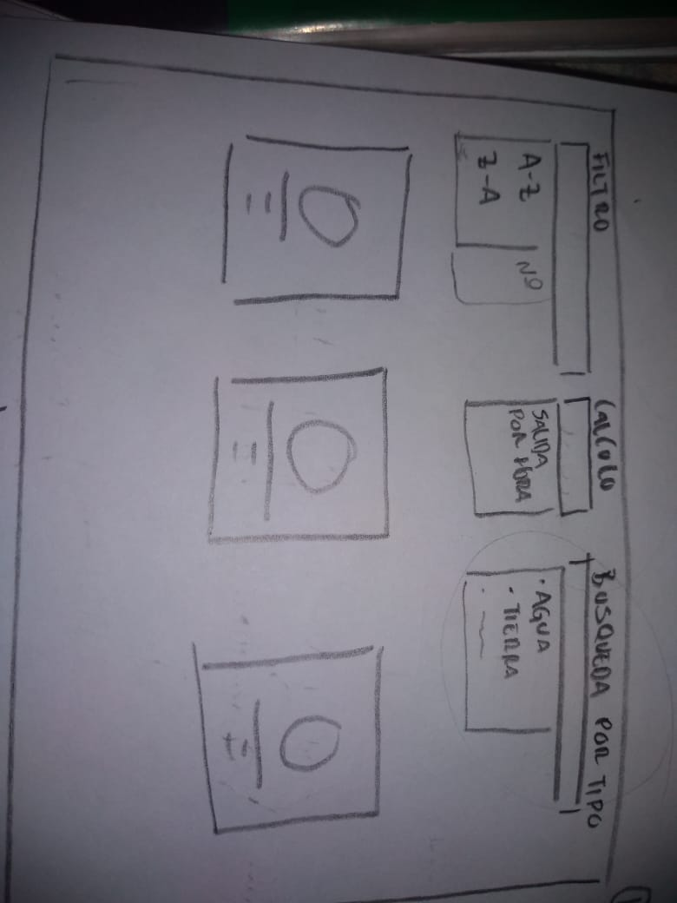
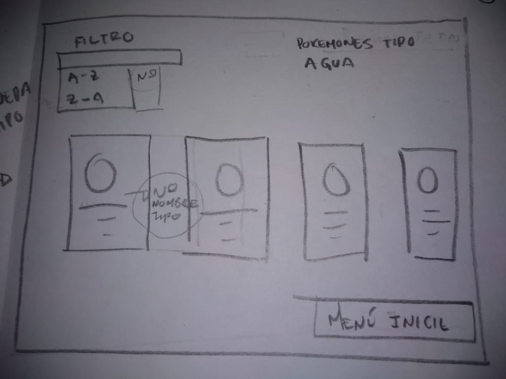
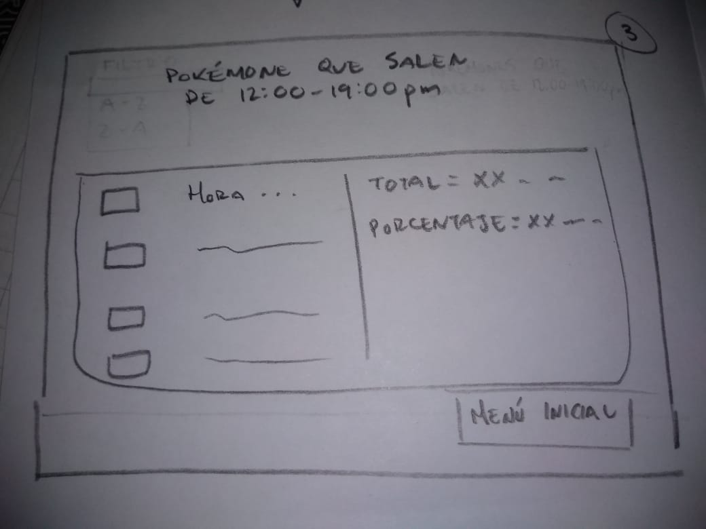

## *POKEDEX APP*

Es una página informativa de la aplicación Pokémon Go! para jugadores novatos y/o de nivel intermedio, en ella podrán encontrar todos los pokémones de la primera generación con su respectiva información la cual es el nombre, tipo, número, hora de salida y sus evoluciones. El usuario puede ordenar numéricamente, puede filtrar según tipo, calcular la hora de salida, y volver a inicio siempre que quiera.

  Aqui está el [link](https://marineslemus007.github.io/SCL009-data-lovers/src/index.html) de la página.

Para realizar este royecto hicimos una organizacion y nos ayudamos con trello
* Organización general: [link](https://trello.com/b/vCLMXuoN/daily-data-lovers)

* Organización diario: [link](https://trello.com/b/NtSRecf4/data-lovers)

## PROTOTIPO DE BAJA FIDELIDAD 
 Para esto hicimos una [encuesta](https://docs.google.com/forms/d/e/1FAIpQLSebA2aWBVW7n2An2sUnxp1CZ5NtSrGVCcvkoVuFlW3eqmIl8w/viewform?usp=sf_link)  para saber cuales eran las necesidades de nuestro usuario.

Estos son los resultados de la encuesta:

  

  

Al hacer el  análisis nos dimos cuenta que el perfil de nuestro usuario iban a ser jugadores novatos y/o intermedio los cuales les gustaría obtener la información de la evolución de estos, el tipo y hora de salida.Después de este estudio hicimos el control de flujo y el prototipo de baja fidelidad.

## Imagen del control del flujo

## Imagenes de prototipo de baja fidelidad

 

## PROTOTIPO DE ALTA FIDELIDAD

Al tener el de baja fidelidad, con la herramienta de diseño visual ¨Figma¨ hicimos el  [prototipo de alta fidelidad](https://www.figma.com/proto/IBQ4CpS4A5yP83N4J0QEfJCx/Untitled?node-id=34%3A1&scaling=min-zoom&redirected=1) y con este hicimos las historias de usuario y  el testeo a diferentes personas.
aqui les dejo el [link](https://app.zeplin.io/project/5cd41b809b7e1c03ae244190) de zeplin

## HISTORIAS DE USUARIO

* Historia de usuario 1:_Yo como_ usuario de Pokémon Go _quiero_ filtrar los pokemones por tipo _para_ reconocer los pokemones que poseo.

* Historia de usuario 2: _Yo como_ usuario de Pokémon Go QUIERO filtrar los pokemones por tipo _para_ saber con cuál pokémon atacar o defenderme en las batallas.

* Historia de usuario 3: _Yo como_ usuario de pokémon go! _quiero_ ordenar los pokémones por número, de manera creciente y decreciente, _para_ tener diferente vistas de los pokémones mostrados.

* Historia de usuario 4: _Yo como_ usuario de Pokémon Go _quiero_ tener un cálculo (porcentaje) asociado a la hora de salida de los pokémones _para_ saber en que tramo del día puedo capturar más pokémones.

## Testeos

 
* Testeo 1: [audio](https://soundcloud.com/dharma-herrera/beta)

  * el usuario pidió un filtro de búsqueda 
  * vista con todos los pokémones y
  * expandir las información de los pokémones

* Testeo 2: [audio](https://soundcloud.com/dharma-herrera/gelen)  

  * información completa de los pokémones
  * un orden alfabetico
  
 _se entendía la información_

* Testeo 3: [audio](https://soundcloud.com/dharma-herrera/nohemi)

  * botón del menú inicial arriba
  * colocar arriba los tres filtros y que queden fijos  

* Testeo 4: [audio](https://soundcloud.com/dharma-herrera/stefany)

  * renombrar el nombre calculo por lo que se iba a mostrar para entenderlo mejor
  * menu inicial fijo

  _estaba organizado y buen contraste_

* Testeo 5: [audio](https://soundcloud.com/dharma-herrera/urzula)

  * filtro de búsqueda por nombre

  _pagina fácil de entender_

* testeo 6: [audio](https://soundcloud.com/dharma-herrera/ignacio)

  * filtro de busqueda por nombre

  _era fácil de hacer las tareas_

## Análisis

* Para el usuario era de facilidad hacer las tareas que se le otorgaron.  
* Nos pidieron incluir un buscador.
* Nos pidieron que todos los pokémones fueran  visibles al.
* Que el botón de inicio estuviera visible al comienzo de la página.
* Renombrar el botón del calculo para entender mejor su función.
* Ordenar alfabeticamente.
* Informaci+on completa de los pokémones

De estas  sugerencias logramos solucionar el botón de inicio, que todos los pokémones fueran visibles,renombrar  el botón de calculo. Mientras que incluir el buscador,  el orden alfabetico y mostrar toda la información de estos se dejara como  implementación mas adelante.

## Testeo con el producto final

aqui esta el [testeo 1](https://www.loom.com/share/ef16a9eae59d4f1e85d14458e0e21ad7), [testeo 2](https://www.loom.com/share/78fc0e874a9f4e56b12b099040723b32) con el producto final.

## Conclusión 

Encontraron buena la página, facil de ocupar, entendible y eran claras las acciones que uno como usuario podía hacer. 